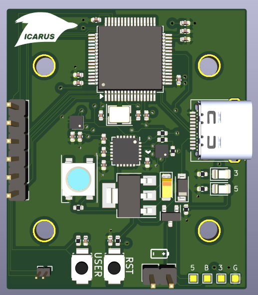

# Icarus Flight Controller

Icarus is a controller for robotics applications.

Firmware is located [here](https://github.com/nnarain/icarus-firmware).

Features:

* Controls 4 DC brushed motors
* IMU (gyro/accelerometer/temperature)
* Barometer
* USB Serial
* Battery sense
* 30.5 x 30.5 millimeter mounting holes (for drones).
