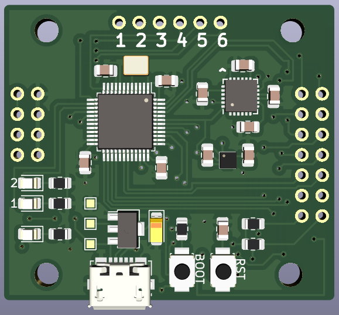

# Icarus controller

Icarus is a controller for robotics applications.

Firmware is located [here](https://github.com/nnarain/icarus-firmware).

Features:

* 6 PWM outputs
* 2x USART ports
* I2C
* 8 GPIO (including breakout for SPI)
* USB 2.0
* IMU (gyro/accelerometer/temperature)
* Barometer
* 30.5 x 30.5 millimeter mounting holes (for drones).
