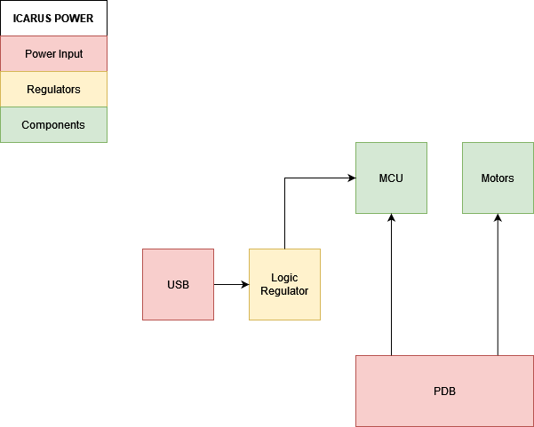
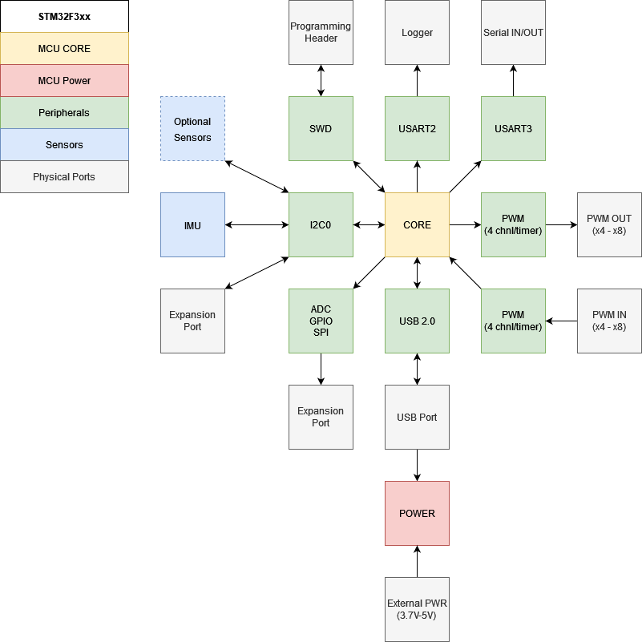

# Design

Full schematics can be viewed here: {{#find schematic}}

To see the bill of materials click here: {{#find ibom}}

# Scope

The scope of this project is to design and build an embedded system that can be used as a controller for multiple robotics projects. Specifically it should be able to drive: diff-drive robots, and micro-quads.

| Priority | Item                               |
| -------- | ---------------------------------- |
| Must     | Support at least 4 motors          |
| Must     | have motion sensor                 |
| Must     | Interface for remote control       |
| Should   | Have USB 2.0 support               |
| Could    | COntrol up to 8 motors (Quadruped) |

# Architecture

* PWM output to drive motors. There is also PWM input for encoder feedback
* An IMU can be used for motion sensing. At minimum a gyro and accelerometer would be required
* RC input would be require as input to the controller

# Power Supply

**Requirements**

Motorized applications typically require two types of power: Logic power for digital components and analog power for the motors.

**Power Supply Inputs**

The board will have two inputs for power:

* Voltage input pins from a PDB (supplying logic and motor power)
* 5V input from a USB connector (supplying just logic power)

# Sensor

**Requirements**

As one of the purposes of this controller is for drones, understanding orientation in the air will be critical.

**Sensor Selection**

* MPU6050 for attitude estimation
* Barometer for altitude

# MCU

The MCU requirements for this project are pretty basic:

* 4 PWM outputs (Up to 8)
* PWM inputs
* 2x USART
* 1x I2C
* Optional USB support

A STM32F302 for the following reasons:

* Commonly used in flight controllers
* Commonly used in general
* Had required peripherals including USB 2.0
* Well supported with Rust

