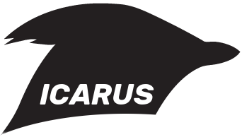

Icarus is a flight controller for micro-quads.

Features:

* ESP32-C3 Module
* Built-in WiFi and Bluetooth
* IMU (gyro/accelerometer/temperature)
* Barometer
* Magnetometer
* USB 2.0
* 30.5 x 30.5 millimeter mounting pattern
